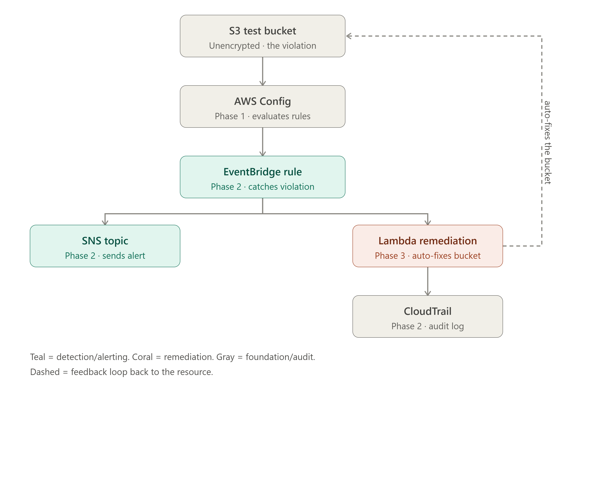
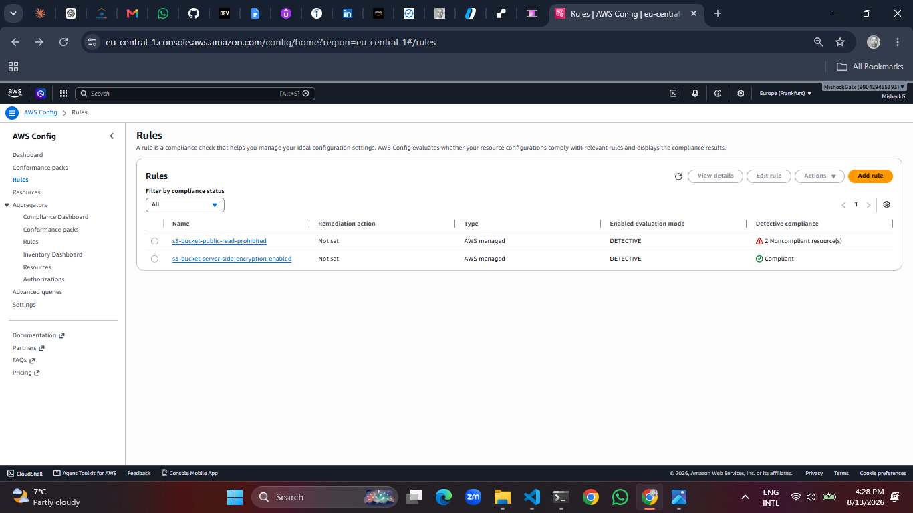
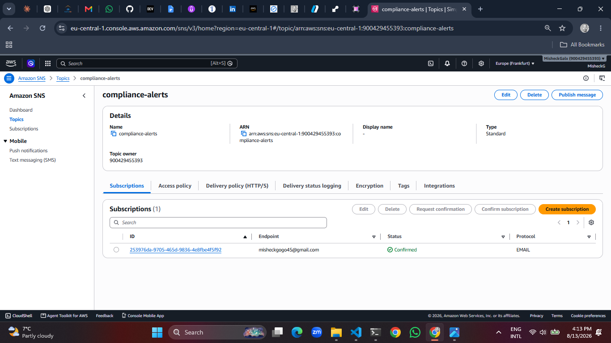
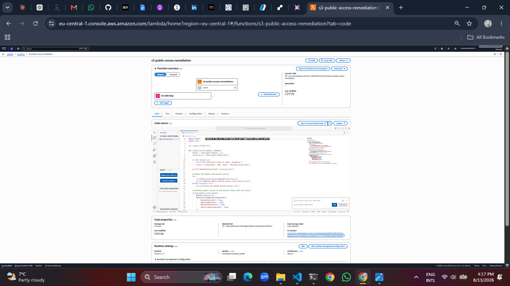
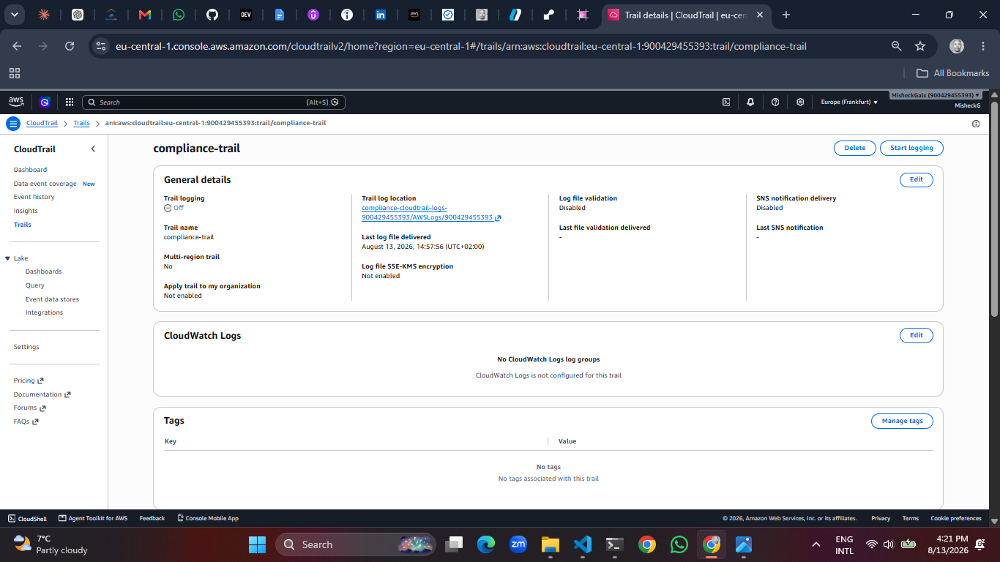
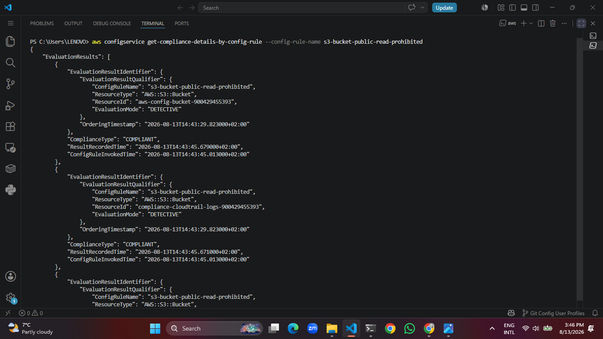

# 🏥 AWS Healthcare Compliance & Automated Remediation Platform

> My first hands-on AWS project built entirely from scratch, from a terminal I'd never opened before, to a working serverless pipeline that catches security violations and fixes them automatically.

---

## The Story

I'm a backend engineer learning cloud and solutions architecture, and this was the project where I actually got my hands dirty in AWS for the first time no prior terminal experience, no prior AWS console experience. Every command in this repo, I typed and understood for the first time while building it.

The idea: simulate what a healthcare company might build to stay on top of HIPAA style security requirements continuously watch cloud resources for misconfigurations, alert someone the moment something's wrong, and where it's safe to do so, fix it automatically without waiting on a human.

> **Disclaimer:** this is a technical demonstration inspired by HIPAA style requirements. It is **not** a certified HIPAA compliant environment, and I'm not claiming regulatory compliance just building and proving out the underlying security engineering concepts.

---

## How It Works

```
AWS Config → EventBridge → SNS (alert)  +  Lambda (auto-fix) → CloudTrail (audit)
```

| Step | What happens |
|---|---|
| 🔍 **AWS Config** | Continuously evaluates S3 buckets against a public access security rule |
| ⚡ **EventBridge** | Watches for a compliance state *change*  the moment a bucket flips to `NON_COMPLIANT` |
| 📧 **SNS** | Emails me immediately with the exact violation |
| 🤖 **Lambda** | Automatically strips the offending public policy and re-locks the bucket |
| 📜 **CloudTrail** | Logs every API call behind the scenes, so there's a full audit trail of what happened and when |

---

## A Real Pivot, Not a Perfect Plan

The project originally called for an **S3 encryption** rule as the demo violation. Partway through building, I discovered AWS now auto-encrypts every new S3 bucket by default so that rule could never actually produce a violation anymore, no matter what I did.

Instead of forcing a fake result, I pivoted to a rule AWS *doesn't* silently fix for you: **S3 public read access**. Honestly, it ended up being a better demo an accidentally public S3 bucket is one of the most common real world causes of cloud data breaches, so catching and auto fixing that is a more meaningful example of what this kind of pipeline is actually for.

---

## Proof It Actually Works

I didn't just build this I tested it end-to-end, unattended, and watched it catch and fix a real violation with zero manual intervention on the remediation step.

**The full pipeline, visualized**


**Config rules, actively evaluating**


**SNS, ready to alert**


**The actual alert email** — sent automatically the moment the violation happened


**Lambda, active and wired to EventBridge**


**CloudTrail, logging every API call**


**Back to compliant — automatically, with no manual fix**


The sequence that produced these: I made the test bucket public on purpose, forced a Config evaluation, and then just... waited. A few minutes later, the email showed up in my inbox, and when I checked the bucket policy, it was already gone Lambda had already fixed it before I even looked.

---

## What's Actually Running

| Component | Resource | Region |
|---|---|---|
| Config recorder | `default` | eu-central-1 |
| Config rule | `s3-bucket-public-read-prohibited` | eu-central-1 |
| Test resource | `compliance-test-bucket-900429455393` | eu-central-1 |
| EventBridge rule | `config-noncompliant-rule` | eu-central-1 |
| SNS topic | `compliance-alerts` | eu-central-1 |
| Lambda function | `s3-public-access-remediation` (Python 3.12) | eu-central-1 |
| IAM role | `lambda-remediation-role` (least-privilege) | — |
| CloudTrail trail | `compliance-trail` | eu-central-1 |

---

## The Remediation Code

[`lambda-remediation/remediation.py`](lambda-remediation/remediation.py) is what actually does the fix. When EventBridge triggers it with a violation event, it:

1. Deletes the public bucket policy causing the violation
2. Re-applies a full public access block as a second layer of protection
3. Logs everything to CloudWatch for traceability

The IAM role behind it only has the specific S3 and logging permissions it needs no wildcard admin access.

---

## Running It Yourself

```bash
# Recreate the violation
aws s3api put-public-access-block --bucket compliance-test-bucket-900429455393 \
  --public-access-block-configuration BlockPublicAcls=false,IgnorePublicAcls=false,BlockPublicPolicy=false,RestrictPublicBuckets=false

aws s3api put-bucket-policy --bucket compliance-test-bucket-900429455393 --policy file://config/public-policy.json

# Force Config to notice
aws configservice start-config-rules-evaluation --config-rule-names s3-bucket-public-read-prohibited

# Then just wait ~1-2 minutes and check your inbox
```

---

## Keeping Costs Down

Nothing here uses EC2, RDS, or NAT Gateways — just S3, Config, EventBridge, SNS, Lambda, and CloudTrail. When I'm not actively demoing it, I pause the two components most likely to accrue charges:

```bash
aws configservice stop-configuration-recorder --configuration-recorder-name default
aws cloudtrail stop-logging --name compliance-trail --region eu-central-1
```

Both restart instantly, no rebuilding required.

---

## What I Actually Learned

This was genuinely my first time in a terminal for real infrastructure work, so this list is more real than it might sound:

- How IAM roles, trust policies, and least-privilege permissions actually fit together (not just in theory)
- Why EventBridge rules match on state *changes*, not just current state — and why that matters for testing
- The difference between an S3 bucket policy and a bucket-level public access block, and how they override each other
- Debugging real AWS errors as they came up — Config's delivery channel needing the recorder to exist first, S3 bucket policies needing explicit cross-service permissions, IAM roles needing a few seconds to propagate before Lambda can use them
- Writing and deploying a Python Lambda function with a properly scoped execution role
- Git and GitHub from the command line, including working across WSL and PowerShell on the same machine

---

## Portfolio Summary

**AWS Healthcare Compliance & Automated Remediation Platform**
Designed and implemented a serverless AWS compliance platform using AWS Config, EventBridge, Lambda, SNS, CloudTrail, and IAM to continuously evaluate cloud resources against security policies, generate real-time compliance alerts, and automatically remediate public-access misconfigurations. Implemented least-privilege IAM and validated a full, unattended, end-to-end detection, notification, remediation, and audit workflow — as a first solo AWS project, built from zero prior hands-on experience.
